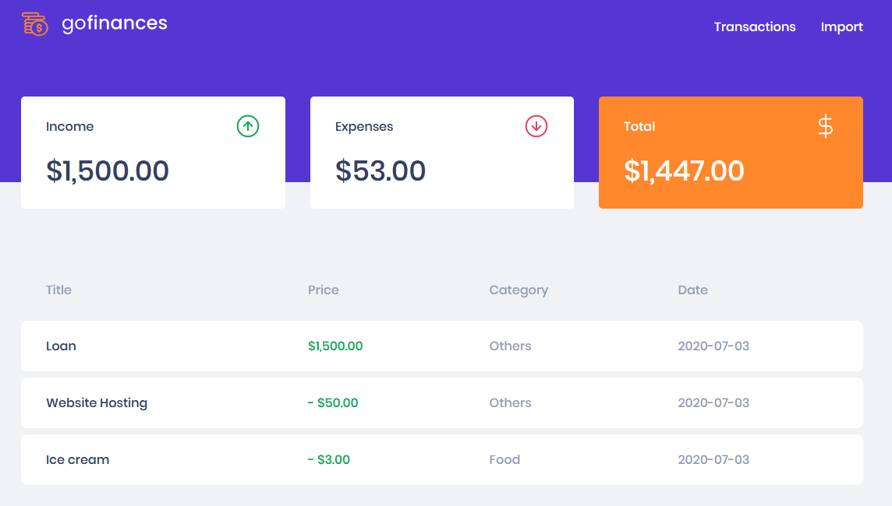
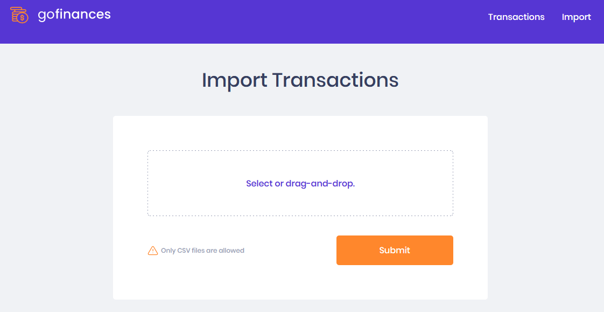

<h3 align="center">
  Challenge 06: ReactJS - GoFinances
</h3>

## :rocket: About the Challenge

The applications connects to the [Node.js backend](https://github.com/yagosansz/gostack11-challenge05) to list stored transactions. It also allows the import of a CSV file that will load new records into the database.

### Application's Screens

<h1 align="center">
    
</h1>

<h1 align="center">
    
</h1>

### Application's Features

- **`List all the transactions`**: The Dashboard page lists all transactions in a table with the `title`, `value`, `type`, and `category` fields for all transactions created through the API.

- **`Display the transactions balance`**: The Dashboard page displays the transactions' `total balance`, as well as the `income` and `expenses`.

- **`Import CSV files`**: The Import page allows submiting a csv file to the application's backend, which will import all the transactions into the database.

### Tests Breakdown

- **`should be able to list the total balance inside the cards`**: For this test to pass, the Dashboard page should be able to display the `total balance`, `income`, and `expenses` that are returned from the backend.

- **`should be able to list the transactions`**: For this test to pass, the aplication should be able to properly display in a table all transactions sent from the backend.

- **`should be able to navigate to the import page`**: For this test to pass, the user should be redirect to the Import page by clicking on the `Import` button on the top-right corner.

- **`should be able to upload a file`**: For this test to pass, the user should be upload a csv file by using the drag-n-drop feature, displaying the imported filename once that operation is completed.

### Testing the Application

1. Run `yarn test` to run test suites

## Getting started

1. Clone this repo using `git clone https://github.com/yagosansz/gostack11-challenge06.git`
2. Move yourself to the appropriate directory: `cd gostack11-challenge06` 
3. Run `yarn` to install dependencies 

### Getting started with the backend server

1. Run `yarn start` to start the server
2. Test the routes by either using [Insomnia](https://insomnia.rest/) or [Postman](https://www.getpostman.com/)

---

Made with :heart: by Yago!
